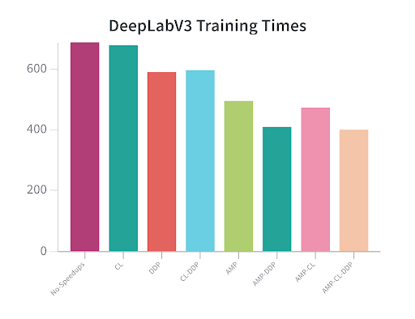

# DeepLabV3

---

## Training The Model

### Data Structure
The training and test images need to be structured in a specific way for the model run correctly.
The folder structure needs to be as follows:
```text
path/to/dir
    |--- train
        |--- images_tiled  # contains training images
        |--- masks_tiled   # contains training labels
    |--- test
        |--- images_tiled  # contains test images
        |--- masks_tiled   # contains test labels
```
**NOTE**: directory names must be the same as outlined above

### Usage
```commandline
usage: DeepLabV3.py [-h] config_file

positional arguments:
  config_file  path to config file

optional arguments:
  -h, --help   show this help message and exit

```

Example
```commandline
python DeepLabV3.py config/config.yaml
```

### Config File
An example config file is provided below:
```commandline
config:
  run: demo
  data-dir: /home/usyd-04a/synthetic/
  checkpoint-dir: /home/usyd-04a/checkpoints/deeplab
  classes: 2

hyper-params:
  batch-size: 60
  learning-rate: 0.0001
  epochs: 5
  workers: 4

amp:
  enabled: False

channels-last:
  enabled: False

distributed:
  enabled: True
  nodes: 1
  ip-address: localhost
  ngpus: null
  local-ranks: 0

wandb:
  enabled: False
  project-name: DeepLabV3-Demo
```


---

## Benchmarks
These benchmarks were performed using a subset of the Rareplanes dataset, approximately 5% of the total images.

| AMP | Channels Last | DDP | Run 1 | Run 2 | Run 3 | Average |
|:---:|:-------------:|:---:|-------|-------|-------|---------|
| [X] |      [X]      | [X] | 407   | 410   | 411   | 409     |
| [X] |      [X]      |     | 479   | 478   | 481   | 479     |
| [X] |               | [X] | 418   | 418   | 418   | 418     |
| [X] |               |     | 501   | 504   | 504   | 503     |
|     |      [X]      | [X] | 604   | 606   | 609   | 606     |
|     |      [X]      |     | 684   | 688   | 688   | 687     |
|     |               | [X] | 597   | 600   | 598   | 598     |
|     |               |     | 696   | 697   | 699   | 697     |




---

## Making Predictions (Inference)
After training the model on a dataset, predictions can be made on a set of images using the `inference.py` script.
This will display the original image with the plane mask overlay.

### Usage
```commandline
usage: inference.py [-h] [-s START_INDEX] [-e END_INDEX] model image_dir prediction_dir

positional arguments:
  model                 checkpoint file for pretrained model
  image_dir             path to directory containing images to run through the model
  prediction_dir        path to directory to save predictions made by the model

options:
  -h, --help            show this help message and exit
  -s START_INDEX, --start_index START_INDEX
  -e END_INDEX, --end_index END_INDEX
```

Example
```commandline
python inference.py -s 0 -e 5 /home/usyd-04a/checkpoints/deeplab/trial.pth /home/usyd-04a/synthetic/test/images/ /home/usyd-04a/marcus/comp3888_w08_02/DeepLabV3/predictions
```

### Output
