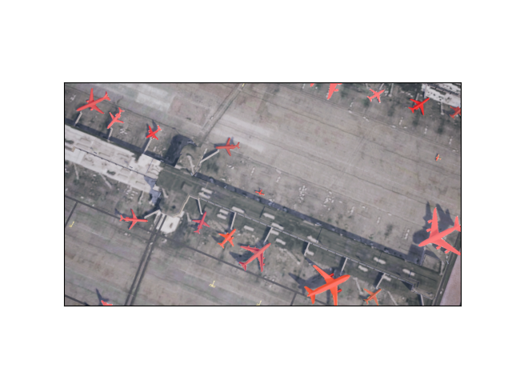

# DeepLabV3

---

## Training The Model

### Data Structure
The training and test images need to be structured in a specific way for the model run correctly.
The folder structure needs to be as follows:
```text
path/to/dir
    |--- train
        |--- images_tiled  # contains training images
        |--- masks_tiled   # contains training labels
    |--- test
        |--- images_tiled  # contains test images
        |--- masks_tiled   # contains test labels
```
**NOTE**: directory names must be the same as outlined above

### Usage
```commandline
usage: DeepLabV3Model.py [-h] [-c CHECKPOINT] [-b BATCH_SIZE] [-lr LEARNING_RATE] [-e EPOCHS] [-w WORKERS] [-n NUM_CLASSES] data_dir

positional arguments:
  data_dir              path to directory containing test and train images

optional arguments:
  -h, --help            show this help message and exit
  -c CHECKPOINT, --checkpoint CHECKPOINT
                        filename for model checkpoint to be saved as
  -b BATCH_SIZE, --batch-size BATCH_SIZE
                        dataloader batch size
  -lr LEARNING_RATE, --learning-rate LEARNING_RATE
                        learning rate to be applied to the model
  -e EPOCHS, --epochs EPOCHS
                        number of epochs to train the model for
  -w WORKERS, --workers WORKERS
                        number of workers used in the dataloader
  -n NUM_CLASSES, --num-classes NUM_CLASSES
                        number of classes for semantic segmentation

```

Example
```commandline
python DeepLabV3.py -c "trial.pth" -b 16 -lr 0.0005 -e 25 -w 2 -n 2 /home/usyd-04a/synthetic/
```
### Checkpoints
If a checkpoint filename is provided the model with be saved in the directory `/DeepLabV3/checkpoints`.

---

## Making Predictions (Inference)
After training the model on a dataset, predictions can bew made on a set of images using the `/DeepLabV3/inference.py` script.
This will display the original image with the plane mask overlay.

### Arguments
* model (str) - checkpoint file for a pretrained model
* image_dir (path) - path to a directory which contains the images which will be passed through the model

### Usage
```commandline
usage: inference.py [-h] [-s START_INDEX] [-e END_INDEX] model image_dir

positional arguments:
  model                 checkpoint file for pretrained model
  image_dir             path to directory containing images to run through the model

optional arguments:
  -h, --help            show this help message and exit
  -s START_INDEX, --start_index START_INDEX
                        the starting index of test images to convert to mask
  -e END_INDEX, --end_index END_INDEX
                        the ending index of test images to convert to mask

```

Example
```commandline
python inference.py ./checkpoints/deepLabV3.pt /home/usyd-04a/synthetic/test/images/ -s 0 -e 1
```

### Output
