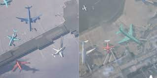

# Build the best AI: Aerial Imaging
USYD-04A / COMP3888_W08_02

---

## Table of Contents
1. [Overview](#markdown-header-overview)
      * [Model Catalog](#markdown-header-model-catalog)
      * [The Rareplanes Dataset](#markdown-header-the-rareplanes-dataset)
2. [Getting Started](#markdown-header-getting-Started)
      * [Prerequisites](#markdown-header-prerequisites)
      * [Installation](#markdown-header-installation)
3. [Usage](#markdown-header-usage)

---

## Overview
This project investigates the [Rareplanes dataset](https://www.cosmiqworks.org/rareplanes/) and benchmarks the
performance of various semantic / instance segmentation machine learning models.

### Model Catalog

   - [x] Fully Convolutional Network (FCN)
   - [x] DeepLabV3
   - [x] UNet
   - [x] Mask R-CNN

### The Rareplanes Dataset
The Rareplanes dataset is an open-source dataset from CosmiQ Works and AI.Reverie which incorporates
both real and synthetic data of satellite imagery. The satellite images are aerial images of various
aircraft, i.e. jets and passenger planes. Our project focuses on the use of the synthetically generated images.

---

## Getting Started
### Prerequisites
It is recommended to create a python virtual environment e.g. venv, to manage python packages. Steps to setup venv are provided
below.
### Installation
1. Clone the repository

`git clone git@bitbucket.org:ahua5289/comp3888_w08_02.git`

2. Open folder

`cd comp3888_w08_02`

3. Create virtual environment

`python3 -m venv ./venv/`

4. Activate virtual environment

`source venv/bin/activate`

5. Install packages

`pip install -r requirements.txt`

---
## Usage
Complete the following steps to get ready for training the models:

1. **Download the dataset**. It is recommended to begin with a small portion of the dataset to reduce 
training time, i.e. 1000 images. Instructions for downloading can be found [here](./rareplanes)

2. **Preprocess the images**. For the images to be compatible for training they must be preprocessed. Instructions for
preprocessing can be found [here](./preprocessing)

3. **Train the models**. Instructions for each model are available here:

      * [FCN](./fcn)
      * [DeepLabV3](./DeepLabV3)
      * [UNet](./unet)
      * [Mask R-CNN](./mask)

4. **Visualise model inferences**. Use a trained model's checkpoint file to make predictions
on a set of images and view the results. Instructions for each model's inference can be found in the links above.