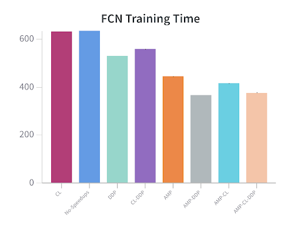
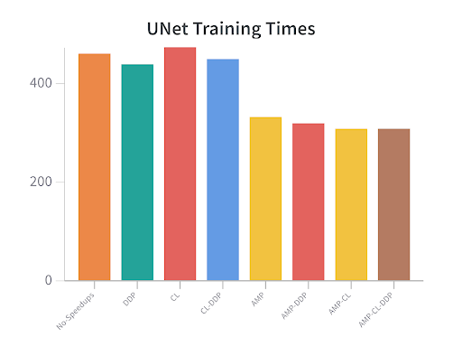
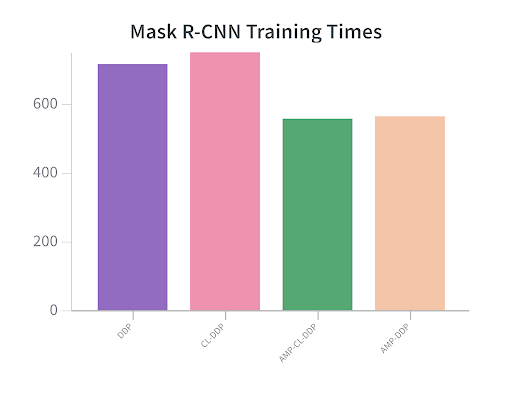

# Build the best AI: Aerial Imaging
USYD-04A / COMP3888_W08_02

---

## Table of Contents
1. [Overview](#markdown-header-overview)
      * [Model Catalog](#markdown-header-model-catalog)
      * [The Rareplanes Dataset](#markdown-header-the-rareplanes-dataset)
2. [Getting Started](#markdown-header-getting-Started)
      * [Prerequisites](#markdown-header-prerequisites)
      * [Installation](#markdown-header-installation)
3. [Usage](#markdown-header-usage)
4. [Speed Up Techniques](#markdown-header-speed-up-techniques)
      * [Automatic Mixed Precision (AMP)](#markdown-header-automatic-mixed-precision-(amp))
      * [Distributed Data Parallel (DDP)](#markdown-header-distributed-data-parallel-(ddp))
      * [Channels Last Memory Format](#markdown-header-channels-last-memory-format)
      * [CUDA Graphs](#markdown-header-cuda-graphs)
      * [Benchmarks](#markdown-header-benchmarks)

---

## Overview
This project investigates the [Rareplanes dataset](https://www.cosmiqworks.org/rareplanes/) and benchmarks the
performance of various semantic / instance segmentation machine learning models.

### Model Catalog

   - [x] Fully Convolutional Network (FCN)
   - [x] DeepLabV3
   - [x] UNet
   - [x] Mask R-CNN

### The Rareplanes Dataset
The Rareplanes dataset is an open-source dataset from CosmiQ Works and AI.Reverie which incorporates
both real and synthetic data of satellite imagery. The satellite images are aerial images of various
aircraft, i.e. jets and passenger planes. Our project focuses on the use of the synthetically generated images.

---

## Getting Started
### Prerequisites
It is recommended to create a python virtual environment e.g. venv, to manage python packages. Steps to setup venv are provided
below.
### Installation
1. Clone the repository

`git clone git@bitbucket.org:ahua5289/comp3888_w08_02.git`

2. Open folder

`cd comp3888_w08_02`

3. Create virtual environment

`python3 -m venv ./venv/`

4. Activate virtual environment

`source venv/bin/activate`

5. Install packages

`pip install -r requirements.txt`

---
## Usage
Complete the following steps to get ready for training the models:

1. **Download the dataset**. It is recommended to begin with a small portion of the dataset to reduce 
training time, i.e. 1000 images. Instructions for downloading can be found [here](./rareplanes)

2. **Preprocess the images**. For the images to be compatible for training they must be preprocessed. Instructions for
preprocessing can be found [here](./preprocessing)

3. **Train the models**. Instructions for each model are available here:

      * [FCN](./fcn)
      * [DeepLabV3](./DeepLabV3)
      * [UNet](./unet)
      * [Mask R-CNN](./mask)

4. **Visualise model inferences**. Use a trained model's checkpoint file to make predictions
on a set of images and view the results. Instructions for each model's inference can be found in the links above.

---
## Speed Up Techniques
This project aims to explore various speed up techniques and their effectiveness on
different models. Also, the combinations of different techniques are investigated.
The optimisations used in this project are AMP, DDP, Channels Last, and CUDA graphs.

### Automatic Mixed Precision (AMP)

[CUDA Automatic Mixed Precision examples](https://pytorch.org/docs/stable/notes/amp_examples.html#working-with-multiple-gpus)

PyTorch provides convenience methods for mixed precision, where some operations use the torch.float32 (float) 
datatype and other operations use lower precision floating point datatype (lower_precision_fp): torch.float16 
(half) or torch.bfloat16. Some ops, like linear layers and convolutions, are much faster in lower_precision_fp. 
Other ops, like reductions, often require the dynamic range of float32. Mixed precision tries to match each op to 
its appropriate datatype.

AMP can be enabled on the following models:

   - [x] FCN
   - [x] DeepLabV3
   - [x] UNet
   - [x] Mask R-CNN

### Distributed Data Parallel (DDP)

[Getting Started with Distributed Data Parallel](https://pytorch.org/tutorials/intermediate/ddp_tutorial.html)

DistributedDataParallel (DDP) implements data parallelism at the module level which can run across multiple 
machines. Applications using DDP should spawn multiple processes and create a single DDP instance per process. 
DDP uses collective communications in the torch.distributed package to synchronize gradients and buffers. 

DDP can be enabled on the following models:

   - [x] FCN
   - [x] DeepLabV3
   - [x] UNet
   - [x] Mask R-CNN (has to be enabled for multi GPU support)

### Channels Last Memory Format

[(beta) Channels Last Memory Format in PyTorch](https://pytorch.org/tutorials/intermediate/memory_format_tutorial.html)

Channels last memory format is an alternative way of ordering NCHW tensors in memory preserving dimensions ordering. 
Channels last tensors ordered in such a way that channels become the densest 
dimension (aka storing images pixel-per-pixel).

Channels last can be enabled on the following models:

   - [x] FCN
   - [x] DeepLabV3
   - [x] UNet
   - [x] Mask R-CNN

### CUDA Graphs

[Accelerating PyTorch with CUDA Graphs](https://pytorch.org/blog/accelerating-pytorch-with-cuda-graphs/)

CUDA Graphs lets a series of CUDA kernels to be defined and encapsulated as a single unit, i.e., a graph of operations, 
rather than a sequence of individually-launched operations. It provides a mechanism to launch multiple GPU operations 
through a single CPU operation, and hence reduces the launching overheads.

CUDA Graphs can be enabled on the following models:

   - [x] FCN

### Benchmarks

 

