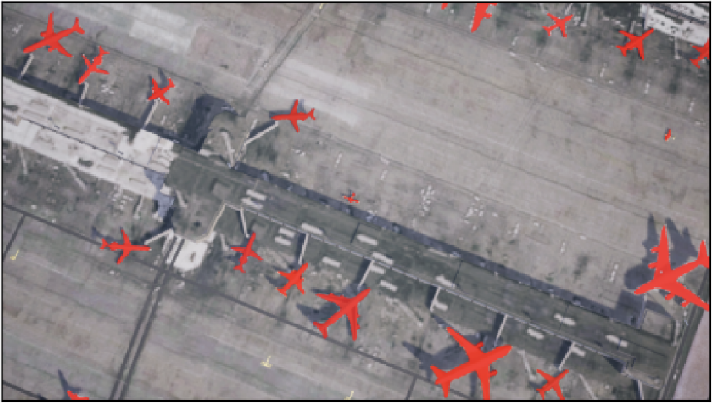

# Fully Convolutional Network (FCN)
This model is based on the paper
[Fully Convolutional Networks for Semantic Segmentation](https://arxiv.org/abs/1411.4038).

---

## Training The Model
```commandline
python FCN.py
```
### Checkpoints
One training is completed the model with be saved to a checkpoint file in the directory `/fcn/checkpoints`.

---

## Making Predictions (Inference)
After training the model on a dataset, predictions can bew made on a set of images using the `inference.py` script.
This will display the original image with the plane mask overlay.

### Arguments
* model (str) - checkpoint file for a pretrained model
* image_dir (path) - path to a directory which contains the images which will be passed through the model

### Usage
```commandline
usage: inference.py [-h] [-i INDEX] model image_dir

positional arguments:
  model                 checkpoint file for pretrained model
  image_dir             path to directory containing images to run through the model

optional arguments:
  -h, --help            show this help message and exit
  -i INDEX, --index INDEX

```
Example
```commandline
python inference.py ./checkpoints/fcn.pt /home/usyd-04a/synthetic/test/images/
```

### Output
