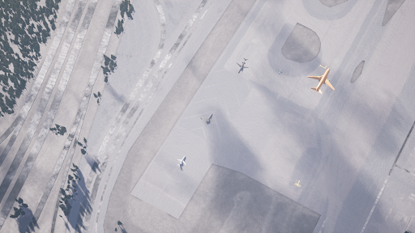
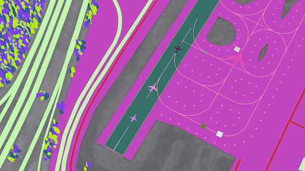
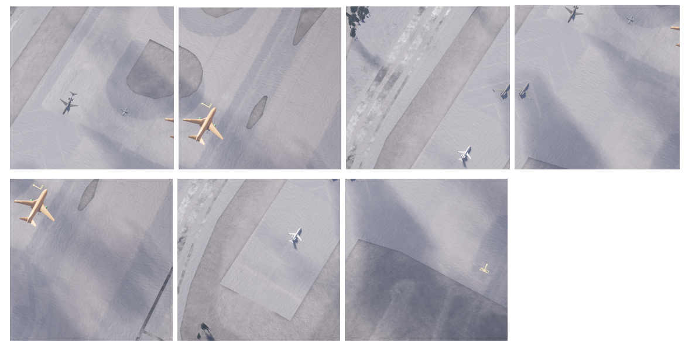
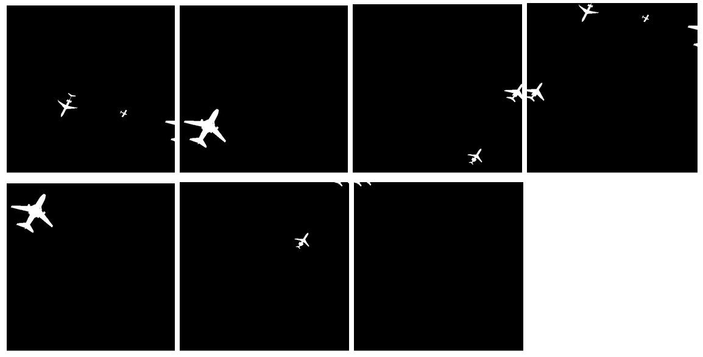

# Preprocessing RarePlanes Synthetic Data
This script reads in the synthetic masks provided by RarePlanes, converts the mask to a greyscale mask where 
black = background and each plane has a distinct greyscale value beginning at 1, then tiles the image into smaller segments.
Tiles with no planes are filtered out.

## Usage
The script has one mandatory argument with is 'path'. This is the path to a directory
which contains the necessary synthetic data from RarePlanes. The directory should have the following
structure:
```text
path/to/dir
    |--- images
    |--- masks
    |--- xmls
```

```commandline
usage: preprocessing.py [-h] [-s TILE_SIZE] [-n NUM_WORKERS] path

positional arguments:
  path                  path to synthetic train/test data directory. Needs to contain 3 dirs -> images, masks, xmls

optional arguments:
  -h, --help            show this help message and exit
  -s TILE_SIZE, --tile-size TILE_SIZE
                        dimension of tile
                        default=512
  -n NUM_WORKERS, --num-workers NUM_WORKERS
                        number of processes utilised
                        default=1
```


### Examples
`python preprocessing_tiling.py ./synthetic/train/`  
`python preprocessing_tiling.py ./synthetic/test/ -n 8`

## Results
Below is an example image, mask pair which will be preprocessed.




Here is the output after preprocessing:




Note that the preprocessed masks have been altered so that the planes are
white for presentation purposes only. Actual masks have greyscale values beginning at 1
and increment for each plane in the image.


